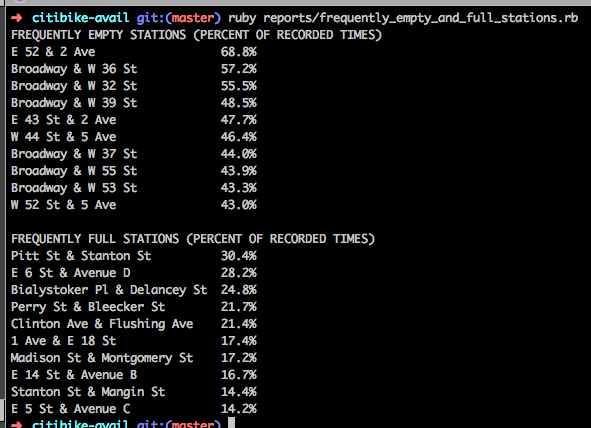

# NYC CitiBike Reporting

Downloads historical data for CitiBike stations, and comes with a set of scripts that can be run to generate various reports.

## Non-technical walkthrough

As noted on their [data page](http://citibikenyc.com/system-data), Citi Bike publishes [a feed of their station information](http://citibikenyc.com/stations/json).  This data is delivered in a popular format called [JSON](http://www.json.org/), and includes the intersection and coordinates of each of their 300+ stations, as well as the number of available bikes and the station capacity.  A friend of mine, [Abe Stanway](http://abe.is/), set up a system to request and store that data.  It has been running for months, and he [made that historical data public](http://data.citibik.es/).

After my [scraping](https://github.com/afeld/bike-report/blob/howaboutwe/scrape.rb) (a.k.a. data collector) script (a.k.a. code) [retrieves the list of stations](https://github.com/afeld/bike-report/blob/ccb29f6dffec344eb4cf5f815453088578ae301c/scrape.rb#L33-L47), it [retrieves](https://github.com/afeld/bike-report/blob/ccb29f6dffec344eb4cf5f815453088578ae301c/scrape.rb#L49-L58) and [stores](https://github.com/afeld/bike-report/blob/ccb29f6dffec344eb4cf5f815453088578ae301c/scrape.rb#L60-L90) the historical data for [the past week](https://github.com/afeld/bike-report/blob/ccb29f6dffec344eb4cf5f815453088578ae301c/scrape.rb#L55) (over three million records) in a local database.  I then run [another script](https://github.com/afeld/bike-report/blob/howaboutwe/reports/frequently_empty_and_full_stations.rb) to aggregate the data.  Each station has one data point per second saying how many bikes it has available, so [the query](https://github.com/afeld/bike-report/blob/ccb29f6dffec344eb4cf5f815453088578ae301c/reports/frequently_empty_and_full_stations.rb#L12-L45) is essentially asking "for each station, how much of the time were there [fewer than two bikes available](https://github.com/afeld/bike-report/blob/ccb29f6dffec344eb4cf5f815453088578ae301c/reports/frequently_empty_and_full_stations.rb#L29), and how much of the time were there [fewer than two docks open](https://github.com/afeld/bike-report/blob/ccb29f6dffec344eb4cf5f815453088578ae301c/reports/frequently_empty_and_full_stations.rb#L38-L39)?"  The results get exported into a CSV, which is [available on Google Docs](https://docs.google.com/spreadsheets/d/1olIpUYlZpcnDt9F0B5d0npgyMYA6jSVyOrpI9bRZ2_s/edit?usp=sharing).

## Usage

First, run the initial setup:

```bash
bundle
bundle exec ruby scrape.rb
```

The data will then be loaded into a [SQLite3](http://www.sqlite.org/) database, `data.db`.  You can explore it with `sqlite3 data.db`.  To run a particular report:

```bash
bundle exec ruby reports/REPORT_NAME.rb
```

For example (8/22/13-8/29/13):



See all of them [here](reports/).

## Resources

* http://citibikenyc.com/system-data
* https://github.com/noneck/CitiBike-OpenData-Law/wiki/CitiBike-NYC-Tools-and-Apps
* https://github.com/edgar/citibikenyc
* http://appservices.citibikenyc.com/data2/stations.php
* http://data.citibik.es/
