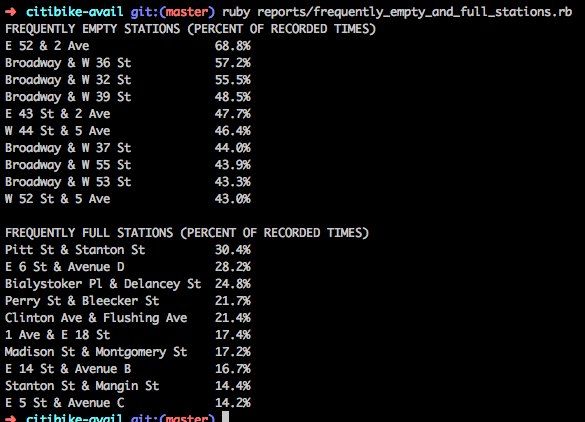

# NYC CitiBike Reporting

Downloads historical data for CitiBike stations, and comes with a set of scripts that can be run to generate various reports.

## Usage

First, run the initial setup:

```bash
bundle
bundle exec ruby scrape.rb
```

The data will then be loaded into a [SQLite3](http://www.sqlite.org/) database, `data.db`.  You can explore it with `sqlite3 data.db`.  To run a particular report:

```bash
bundle exec ruby reports/REPORT_NAME.rb
```

For example (8/22/13-8/29/13):



See all of them [here](reports/).

## Resources

* http://citibikenyc.com/system-data
* https://github.com/noneck/CitiBike-OpenData-Law/wiki/CitiBike-NYC-Tools-and-Apps
* https://github.com/edgar/citibikenyc
* http://appservices.citibikenyc.com/data2/stations.php
* http://data.citibik.es/
